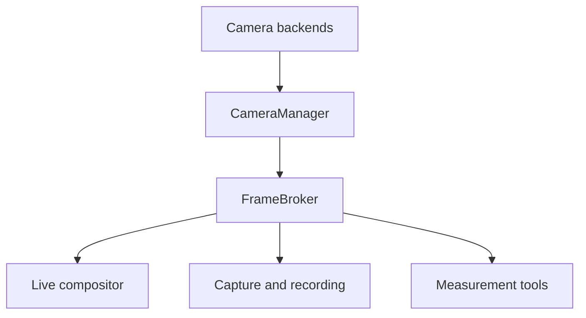

# Multicam 1.0 Architecture

## Purpose

Multicam is a portable multi-camera acquisition, viewing, overlay,
alignment and image-analysis application.

Raspberry Pi is the first supported platform, but the architecture must
remain portable to NVIDIA Jetson, Linux PCs, Windows PCs and future platforms.

## Core Rules

### 1. Core is platform independent

Code under `multicam/core/` must not depend directly on:

- Picamera2
- libcamera
- Aravis
- V4L2
- NVIDIA/Jetson APIs
- Windows camera APIs
- Flask
- HTML or JavaScript

Hardware and platform dependencies belong behind adapters/backends.

### 2. Cameras are generic devices

Application code must not assume fixed camera roles such as:

- RGB
- NIR
- SWIR
- thermal
- cam0
- cam1

A camera has a persistent ID, metadata and capabilities.

Application roles are assigned separately.

### 3. Camera count is dynamic

The application must support any number of cameras that the host hardware
can practically operate.

No code should assume two cameras.

### 4. Camera layers are dynamic and uniform

A view consists of 0..N camera layers. Every displayed camera uses the same
layer model; there is no special base-camera object in the application state.

The first visible camera is normally added as Layer 1 at startup. It can be
disabled, removed or treated like any other layer. Additional cameras are
added as more layers.

Layers are stored as a collection/list. Do not create fixed fields such as
overlay1, overlay2, visible_layer or thermal_overlay.

### 5. Cameras are acquired centrally

Individual GUI windows and tools must not independently open camera hardware.

The camera manager owns acquisition.

Frames are distributed to consumers such as:

- live view
- compositor
- MTF
- future capture
- future recording
- future calibration tools

### 6. Raw data and display data are separate concepts

A camera may provide high-bit-depth or otherwise scientific/raw data while
the UI uses a lower-bandwidth display representation.

Do not destroy raw information merely to make a preview image.

### 7. Capability-driven controls

Camera configuration is generated from reported capabilities where practical.

Examples:

- exposure
- gain
- ROI
- pixel format
- trigger
- temperature
- cooling
- NUC
- autofocus

Tools should ask whether a capability exists instead of assuming a
particular camera model or platform.

### 8. Runtime state is authoritative and shared

Independent windows operate against one shared application state.

Changing camera configuration, layers or alignment in a tool window
must be reflected immediately in the live main view.

### 9. GUI is not the application

Application functionality belongs in core/services.

The web interface is one presentation layer.

A future Qt/PySide or other desktop application should reuse the same core
without rewriting camera management, compositing, alignment or MTF logic.

### 10. Platform-specific acceleration is optional

Portable implementations come first.

Platforms may later provide optimized implementations such as:

- Raspberry Pi hardware paths
- NVIDIA CUDA/NVMM/GStreamer
- PC GPU acceleration
- hardware video encoding

These optimizations must not change the public core interfaces.

## Multicam 1.0 Status

Implemented foundation:

- camera discovery/management framework
- Raspberry Pi Picamera2 backend
- Xenics GenICam/Aravis backend
- generic 0..N camera layers
- shared application state
- live main view
- camera configuration window
- camera profiles
- Raspberry Pi camera provisioning inspection
- generic registration state using target-to-reference 3x3 matrices
- frozen-frame one-click structural matching and reversible draft transforms
- persistent per-camera display orientation applied before registration
- safe capability-driven live-preview resolution changes with selected-camera
  stream restart
- independent focus analysis using shared broker frames and backend-reported
  lens controls

Planned:

- FLIR Boson backend
- runtime hot-plug reconciliation
- automatic alignment refinement and calibration profiles
- selectable DSP pipelines
- MTF service and Workbench integration
- recording
- synchronized capture and measurement sessions
- automated reports
- tracking/detection
- native desktop GUI
- advanced platform acceleration

## Intended High-Level Flow

Shared state and events connect all application services and user interfaces.

Alignment registration is distinct from display-layer positioning. A 3x3
registration matrix maps each target camera's source pixels directly into the
selected reference camera's pixel space. One point produces translation with
frame-size normalization, two points produce a similarity transform, three
points produce the progressive affine draft, and four points produce a planar
homography. Precision mode accepts up to twelve pairs, uses normalized
coordinates for high-resolution numerical stability, rejects inconsistent
matches, and chooses the simplest model whose residual error is acceptable.
The compositor inverse-warps the source and a validity mask onto the reference
canvas so uncovered pixels do not affect underlying layers. Draft transforms
are shared at runtime for live preview but can be rejected before acceptance.

Automatic point matching operates on reduced gradient maps and normalized
correlation, keeping it portable and less dependent on spectral brightness.
Each matched feature is combined with prior pairs to estimate rotation, scale,
and perspective. The automatic result is only a draft; reported confidence,
overlay inspection, manual point correction, nudging, acceptance, and undo
remain operator-facing safeguards.

Focus analysis is a non-owning consumer of the latest broker frame. It computes
relative sharpness from raw-value grayscale data inside an operator-selected
ROI while using the normal display conversion for viewing. Session peak and
trend state remain in the Focus browser window. Hardware lens operations stay
behind generic camera capabilities and are absent for fixed-focus devices.

Camera orientation is a separate per-camera presentation setting. It corrects
physical mounting (right-angle rotation and horizontal/vertical flip) before
alignment and therefore invalidates active alignment coordinates when changed.

Preview-output resolution is also capability-driven. A backend may advertise
safe selectable preview sizes separately from sensor ROI, pixel format, or
scientific acquisition mode. The broker stops, reconfigures, and restarts only
the selected camera; active alignment is cleared because preview pixel
coordinates have changed.

The current broker retains the latest frame for live viewing. Its public
boundary will evolve to support bounded preview subscribers and controlled,
complete measurement capture without allowing tools to access hardware
directly.

## Persistent and Runtime Data

Source-controlled files are examples, defaults, tests, and application code.
Writable operator data must not be stored inside the repository.

Camera profiles default to `~/.config/multicam/camera_profiles/`. The base
configuration directory can be overridden with `MULTICAM_CONFIG_DIR`. Future
rig calibration, measurement-session indexes, and UI preferences should use
the same runtime-data boundary while large captured evidence uses a separately
configured data directory.
